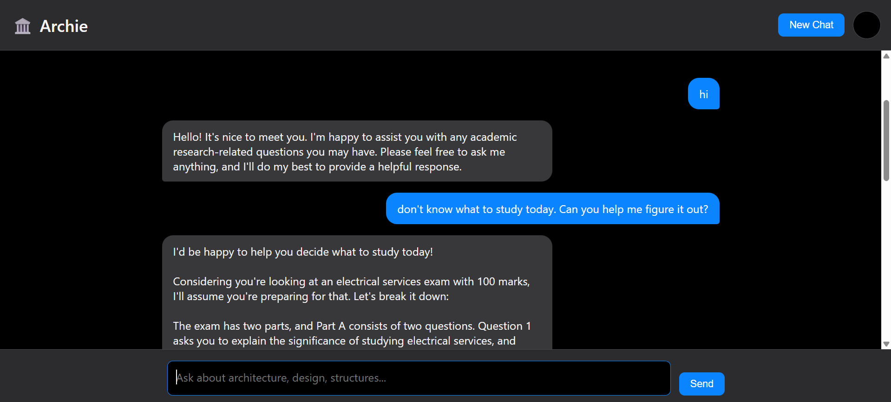

# Archie - B.Arch RAG Chatbot


**Intelligent study assistant for 5th-semester B.Arch students — powered by RAG, LLMs, and semantic search.**

  

---

## Project Overview

Archie is a specialized Retrieval-Augmented Generation (RAG) chatbot designed to help Bachelor of Architecture students efficiently access their 5th-semester course notes and materials. Instead of manually searching through extensive PDFs, students can now ask specific questions and receive contextual, academically-focused answers.

The system processes architectural course notes, creates semantic embeddings for intelligent search, and uses advanced language models to provide accurate responses.

---

## What I Built

### Core Architecture

- **Modular RAG Pipeline**: Complete document processing system from PDF ingestion to intelligent querying.
- **Vector Database**: Persistent storage using Chroma DB for efficient similarity search.
- **LLM Integration**: Connected Groq's Llama 3 70B model for high-quality response generation.
- **Web Interface**: Clean, responsive chat interface for easy student interaction.
- **Monitoring System**: Integrated LangSmith tracing for conversation tracking and system monitoring.

### Technical Stack Used

- **Document Processing**: PyMuPDF for PDF text extraction, custom cleaning and chunking.
- **Embeddings**: HuggingFace's MiniLM for CPU-based semantic embeddings.
- **Vector Storage**: Chroma DB with persistence for fast retrieval.
- **Language Model**: Groq API with Llama 3 70B (llama3-70b-8192) for response generation.
- **Backend**: FastAPI for REST API and static file serving.
- **Frontend**: Vanilla HTML/CSS/JavaScript for chat interface.
- **Monitoring**: LangSmith integration for conversation and chain tracing.

---

## System Architecture

```text
b-arch-chatbot/
├── src/                   # Core processing modules
│   ├── loader.py          # PDF document loading
│   ├── cleaner.py         # Text preprocessing and cleaning
│   ├── splitter.py        # Document chunking with overlap
│   ├── embeddings.py      # Semantic embedding generation
│   ├── vectorstore.py     # Vector database operations
│   └── qa.py              # QA chain with prompt engineering
├── app/                   # Web application
│   ├── template/
│   │   └── index.html     # Student chat interface
│   ├── support.py         # Application helper functions
│   └── app.py             # FastAPI server with endpoints
├── scripts/
│   └── train.py           # Training pipeline orchestration
├── data/                  # Course PDF materials
├── chroma_db/             # Persistent vector database
└── requirements.txt       # Project dependencies

## Running the System
Build / Train the Model
bash
Copy code
python -m scripts.train
Start the Chatbot
bash
Copy code
uvicorn app.app:app --reload


## Future Enhancements

- Multi-semester Support: Cover all B.Arch semesters.

- Visual Content: Add support for architectural diagrams and drawings.

- Collaboration Features: Enable student discussion and shared notes.

